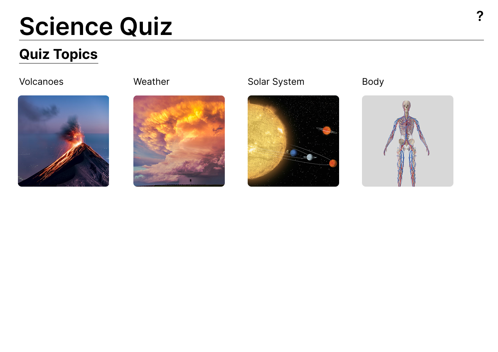
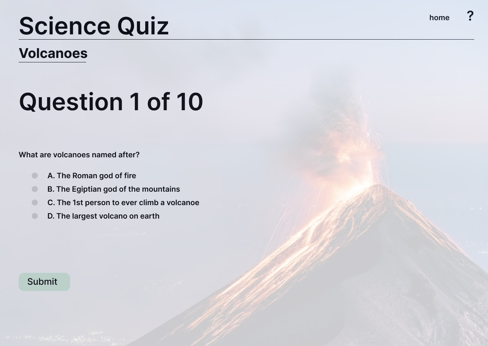
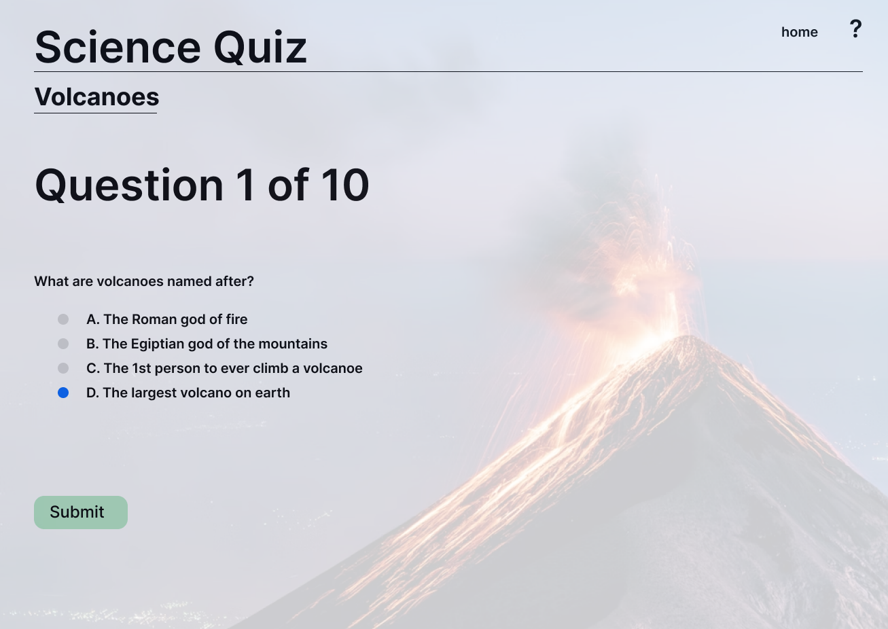
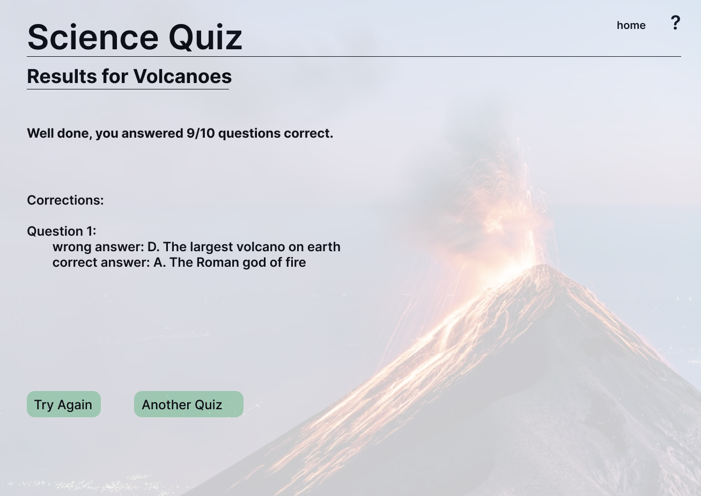

# Quiz — Final Project for Front‑End Development

This project is the final assessment for front‑end development. It is a responsive, accessible quiz application built with modern web technologies.

---

## Project overview
- The quiz will be built using **React** and **Redux** (Though Redux is not necessarily required)
- The application will be **Responsive**, supporting a wide range of devices
- **Accessibility**:
    - screen reader 
    - keyboard navigation
    - contrasting colours
- The quiz will support 3 types of questions: 
    - multiple choice
    - true/false
    - fill in the blanks

---

## Development

Throughout the project:
- **Git and GitHub** will be used to manage development and track bugs and tasks
- **Issues/bugs** will be documented, including:
  - What the problem was
  - How it was fixed
  - The reasoning and process behind the fix
- **Automated tests** will be written for features and core logic throughout development

---

## Project steps
1. Wireframe/scetch the application layout
2. Create the GitHub repository
3. Create React application and link it to the GitHub repository
4. Develop the core application 
    - homepage
    - question page with the 3 question types 
    - result page
    - how to page
5. Introduce **Redux** for the application state management
6. Improve visuals, accessible and responsiveness
7. Non functional requirements
    - performance optimization 
    - Achieve a 90% lighthouse score
8. Ensure 
    - all errors are handled gracefully 
    - users can always recover from an error states
9. Deploy the project on github pages
10. Validate the project on a variety of devices 

---

## Wireframes
### Initial wireframes for:
- home page
- question page example
- question page answered
- result page  

---

## Core application

## Refferences
- volcanoImage-alain-bonnardeaux-tLxGw_ITs7k-unsplash.jpg:              https://unsplash.com/photos/white-clouds-over-snow-covered-mountain-tLxGw_ITs7k 
- bodyImage-julien-tromeur-ZMK0DU5wARA-unsplash.jpg:                    https://unsplash.com/photos/a-3d-image-of-the-human-body-and-the-structure-of-the-body-ZMK0DU5wARA
- solarSystemImagenasa-hubble-space-telescope-rZhFmSl1Jow-unsplash.jpg: https://unsplash.com/photos/an-artists-rendering-of-the-solar-system-rZhFmSl1Jow 
- weatherImage-noaa-ZVhm6rEKEX8-unsplash.jpg:                           https://unsplash.com/photos/orange-and-gray-clouds-during-sunset-ZVhm6rEKEX8 
- question-inquiry-icon.png:                                            https://uxwing.com/question-inquiry-icon/
- homepage-icon.png                                                     https://uxwing.com/homepage-icon/

# Getting Started with Create React App

This project was bootstrapped with [Create React App](https://github.com/facebook/create-react-app).

## Available Scripts

In the project directory, you can run:

### `npm start`

Runs the app in the development mode.\
Open [http://localhost:3000](http://localhost:3000) to view it in your browser.

The page will reload when you make changes.\
You may also see any lint errors in the console.

### `npm test`

Launches the test runner in the interactive watch mode.\
See the section about [running tests](https://facebook.github.io/create-react-app/docs/running-tests) for more information.

### `npm run build`

Builds the app for production to the `build` folder.\
It correctly bundles React in production mode and optimizes the build for the best performance.

The build is minified and the filenames include the hashes.\
Your app is ready to be deployed!

See the section about [deployment](https://facebook.github.io/create-react-app/docs/deployment) for more information.

### `npm run eject`

**Note: this is a one-way operation. Once you `eject`, you can't go back!**

If you aren't satisfied with the build tool and configuration choices, you can `eject` at any time. This command will remove the single build dependency from your project.

Instead, it will copy all the configuration files and the transitive dependencies (webpack, Babel, ESLint, etc) right into your project so you have full control over them. All of the commands except `eject` will still work, but they will point to the copied scripts so you can tweak them. At this point you're on your own.

You don't have to ever use `eject`. The curated feature set is suitable for small and middle deployments, and you shouldn't feel obligated to use this feature. However we understand that this tool wouldn't be useful if you couldn't customize it when you are ready for it.

## Learn More

You can learn more in the [Create React App documentation](https://facebook.github.io/create-react-app/docs/getting-started).

To learn React, check out the [React documentation](https://reactjs.org/).

### Code Splitting

This section has moved here: [https://facebook.github.io/create-react-app/docs/code-splitting](https://facebook.github.io/create-react-app/docs/code-splitting)

### Analyzing the Bundle Size

This section has moved here: [https://facebook.github.io/create-react-app/docs/analyzing-the-bundle-size](https://facebook.github.io/create-react-app/docs/analyzing-the-bundle-size)

### Making a Progressive Web App

This section has moved here: [https://facebook.github.io/create-react-app/docs/making-a-progressive-web-app](https://facebook.github.io/create-react-app/docs/making-a-progressive-web-app)

### Advanced Configuration

This section has moved here: [https://facebook.github.io/create-react-app/docs/advanced-configuration](https://facebook.github.io/create-react-app/docs/advanced-configuration)

### Deployment

This section has moved here: [https://facebook.github.io/create-react-app/docs/deployment](https://facebook.github.io/create-react-app/docs/deployment)

### `npm run build` fails to minify

This section has moved here: [https://facebook.github.io/create-react-app/docs/troubleshooting#npm-run-build-fails-to-minify](https://facebook.github.io/create-react-app/docs/troubleshooting#npm-run-build-fails-to-minify)
