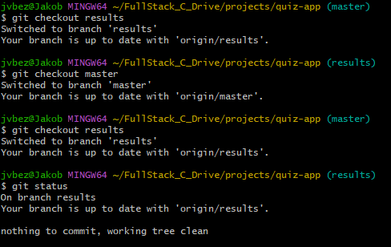

# Quiz — Final Project for Front‑End Development

This project is the final assessment for front‑end development. It is a responsive, accessible quiz application built with modern web technologies.

---

## Project overview
- The quiz will be built using **React** and **Redux** (Though Redux is not necessarily required)
- The application will be **Responsive**, supporting a wide range of devices
- **Accessibility**:
    - screen reader 
    - keyboard navigation
    - contrasting colours
- The quiz will support 3 types of questions: 
    - multiple choice
    - true/false
    - fill in the blanks

---

## Development

Throughout the project:
- **Git and GitHub** will be used to manage development and track bugs and tasks
- **Issues/bugs** will be documented, including:
  - What the problem was
  - How it was fixed
  - The reasoning and process behind the fix
- **Automated tests** will be written for features and core logic throughout development

---

## Project steps
1. Wireframe/scetch the application layout
2. Create the GitHub repository
3. Create React application and link it to the GitHub repository
4. Develop the core application 
    - homepage
    - question page with the 3 question types 
    - result page
    - how to page
5. Introduce **Redux** for the application state management
6. Improve visuals, accessible and responsiveness
7. Non functional requirements
    - performance optimization 
    - Achieve a 90% lighthouse score
8. Ensure 
    - all errors are handled gracefully 
    - users can always recover from an error states
9. Deploy the project on github pages
10. Validate the project on a variety of devices 

---

## Wireframes
### Initial wireframes for:
- home page
- question page example
- question page answered
- result page  

---

## Core application
### Challange 1#
I want to have the option to implement multiple quizzes with different topics.
I want the quizzes to be defined in the quizSlice.js using REDUX store.
currently the hompage has the quiz topics and images hard coded like below.

I do not want the hompage to be hardcoded, I want the hompage to cycle throught the quizzes and display them accordingly.
this keeps the code in hompage nice and short and it will need minimal updates when new quizzes are introduced.

I need to work out how to cylcle through the quizzes in the store and display the quiz title and immage where the immage is also the clickable link to do the quiz.
And this without duplicate code for each quiz.

using "Object.values().map(() => ())" will allow me to cycle through an object that has multiple objects inside.
This can then be used in turn to dinamicly display the quiz title and immage stored in the individual quiz object.

                {Object.values(quizzes).map((quiz) => (
                    

                        
{quiz.title}

                         {navigate("/questionspage")}}
                        />
                    

                ))}

                
### Challange 2#
in the quizSlice the question object for "trueFalse" questions uses boolean values to confirm correct answer or not.
v5: { 
    id: 'v5', 
    type: 'trueFalse', 
    question: 'Some volcanoes form under the sea.', 
    correctAnswer: True },
                    
This made validating the anwer different then validating the answer on the other type of questions in the resultslice.

I did not like this approac so I changed the object for "trueFalse" questions to be the same as the other question types, with clear options for both "true" and "false" in an object.
this way the same code that checks the other 2 question types can now be used for the "trueFalse" questions.

v5: { 
    id: 'v5', 
    type: 'trueFalse', 
    question: 'Some volcanoes form under the sea.', 
    options: { a: 'true', b: 'false' }, 
    correctAnswer: 'a' },

### Challange 3#
I could not get the questionspage to display the "multipleChoise" questions dinamicly after altering the object for "trueFalse" questions and giving it a legitamate answer (refer to Challange 2#).

I used the below logic for determining what the question type was and displaying it accordingly:

currentQuestion.type === 'multipleChoice' || currentQuestion.type === 'trueFalse' &&()

Looking into this in more detail, I can see that for the left side of the ||  "currentQuestion.type === 'multipleChoice'" the statement is never checked for the && so it always fails.

Adding parentheses solves the issue, with the below, both sides of the || are now checked for && JSX
(currentQuestion.type === 'multipleChoice' || currentQuestion.type === 'trueFalse') &&()

### challange 4#
The results page will show a score of 8/10 yet the answers show that 4 answers are incorrect.
- Compare temporary initial state results for testing against correct answers
    - this shows that 2 answers are incorrect so 8/10 is correct
- find out which answers are marked wrong incorrectly
    - both the "fillInBlanks" questions are marked wrong incorrectly
- in the temporary initial state I set the answers to "v3: ['a', 'c']" and "7: ['e', 'b']"
    - changed it to "v3: ['active', 'dormant']" and v7: ['outer', 'plates'] as this is what the resluts actually would record when the question is answered.
- now the score drops to 6/10 but the answers show only 2 incorrect answers
    - this indicates that the validation is different in the store to the results page
- the validation should be the same and should use the same code if possible
- update to store the key instead of the word in Questionspage
- update the results.slice to fix deal with the keys and not the words

#### challange 5#
Git states my 2 branches are the same

Yet looking at ResultsPage.js it is clear that there are differences between the 2 branches.

Turns out it is a misunderstanding.
"git status" compares to the repo on github and then there is nothing to change.
I merged the "results" branch into "Master", deleted the "results" branch and pushed to the repo on github.

### challange 6#
lighthouse score for performance 76%
- reduce immage size from 1300-1600 kb to 30-50 kb and converting them to .webp
- reduce the max size of the immages in the index.css to 300px so it the quality reduction is not noticable
This moved the performance score up to 100% instantly

## Refferences
- volcanoImage-alain-bonnardeaux-tLxGw_ITs7k-unsplash.jpg:              https://unsplash.com/photos/white-clouds-over-snow-covered-mountain-tLxGw_ITs7k 
- bodyImage-julien-tromeur-ZMK0DU5wARA-unsplash.jpg:                    https://unsplash.com/photos/a-3d-image-of-the-human-body-and-the-structure-of-the-body-ZMK0DU5wARA
- solarSystemImagenasa-hubble-space-telescope-rZhFmSl1Jow-unsplash.jpg: https://unsplash.com/photos/an-artists-rendering-of-the-solar-system-rZhFmSl1Jow 
- weatherImage-noaa-ZVhm6rEKEX8-unsplash.jpg:                           https://unsplash.com/photos/orange-and-gray-clouds-during-sunset-ZVhm6rEKEX8 
- question-inquiry-icon.png:                                            https://uxwing.com/question-inquiry-icon/
- homepage-icon.png                                                     https://uxwing.com/homepage-icon/
- diagnostic-icon.png                                                   https://uxwing.com/diagnostic-icon/

